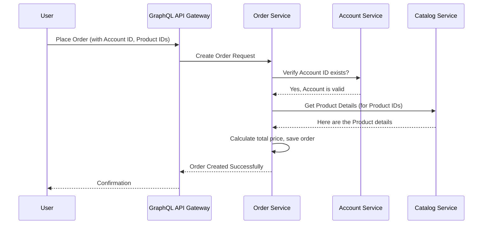

# Chapter 1: Microservice Architecture

Welcome to the `go-grpc-graphql-microservices` tutorial! We're going to build a simple online store system together. But before we dive into the code, let's talk about the foundational idea behind how we'll structure our project: **Microservice Architecture**.

## What's the Big Deal? Why Not Just One Big Application?

Imagine you're building an online store. You need features like:
*   Managing user accounts (sign up, login)
*   Displaying products in a catalog
*   Handling customer orders

Traditionally, you might build all these features into **one single, large application**. This is often called a **Monolith** (like one giant stone block).


*(Image: A single large box representing the entire application)*

This works fine for small projects. But as the online store grows, adding new features or fixing bugs in one area (like Orders) could accidentally break something in another area (like Accounts). Updating the whole application becomes risky and slow. Scaling becomes tricky too – if only the product catalog gets a lot of traffic, you still have to scale the *entire* application, wasting resources.

**Microservice Architecture solves this problem!**

Instead of one big application, we break it down into several smaller, independent services. Each service focuses on doing *one specific job* really well.

For our online store, we can have:
1.  **Account Service:** Handles everything related to user accounts.
2.  **Catalog Service:** Manages the products available for sale.
3.  **Order Service:** Takes care of processing customer orders.

Think of it like different departments in a company:
*   Human Resources (HR) manages employee information (like our **Account Service**).
*   Inventory manages the products the company has (like our **Catalog Service**).
*   Sales processes customer purchases (like our **Order Service**).

Each department has its own tasks and responsibilities, but they communicate with each other to achieve the company's overall goals. Our microservices will work similarly.


*(Image: Separate boxes for Account, Catalog, Order services, possibly with arrows indicating communication)*

This separation brings several advantages:
*   **Easier Development:** Different teams can work on different services simultaneously without stepping on each other's toes.
*   **Independent Deployment:** You can update the Catalog Service without having to redeploy the Account or Order services. This means faster updates and less risk.
*   **Targeted Scaling:** If the Catalog Service gets popular, you can add more resources just for that service, without touching the others.
*   **Technology Flexibility:** Each service could potentially be written in a different programming language (though in our project, we'll use Go for all of them).

## Our Project Structure: A Sneak Peek

In our project, you'll see separate directories for each service: `account/`, `catalog/`, and `order/`. This reflects the microservice architecture. Each of these directories contains the code for one specific service.

Each service is built and packaged independently. We use Docker for this. Look at the `Dockerfile` for the Account service:

```dockerfile
# File: account/app.dockerfile
# Use a Go language base image
FROM golang:1.13-alpine3.11 AS build
WORKDIR /go/src/github.com/akhilsharma90/go-graphql-microservice

# Copy necessary files for building
COPY go.mod go.sum ./
COPY vendor vendor
COPY account account # Only copy account service code

# Build the account service application
RUN GO111MODULE=on go build -mod vendor -o /go/bin/app ./account/cmd/account

# --- Start a new, smaller image ---
FROM alpine:3.11
WORKDIR /usr/bin
# Copy only the built application from the previous stage
COPY --from=build /go/bin .
EXPOSE 8080 # The port the service will listen on
CMD ["app"] # Run the service
```

This `Dockerfile` defines the steps to build *only* the Account service into a runnable package (a Docker image). Notice how it specifically copies the `account` directory. The `catalog` and `order` services have very similar `Dockerfile`s (you can find them in `catalog/app.dockerfile` and `order/app.dockerfile`), demonstrating their independence.

## How Do Services Talk to Each Other?

If the services are separate, how does the Order Service know which products were ordered (from the Catalog Service) or who placed the order (from the Account Service)?

They need to communicate! In our project, they will talk to each other using a technology called **gRPC**. Think of gRPC as a fast and efficient messenger service between our microservices. We define the "language" they speak using something called **Protocol Buffers**.

We'll dive deep into this in the [gRPC & Protocol Buffers](06_grpc___protocol_buffers_.md) chapter. For now, just understand that these independent services *can* and *do* communicate to work together.

Let's visualize a simple interaction, like placing an order:



This diagram shows:
1.  The User interacts with a single entry point (our [GraphQL API Gateway](02_graphql_api_gateway_.md) - more on this next chapter!).
2.  The Gateway forwards the request to the appropriate service (Order Service).
3.  The Order Service needs information from other services (Account and Catalog), so it communicates with them directly.
4.  Finally, a response goes back to the user.

Even though there are multiple services involved, they collaborate to fulfill the user's request.

## Conclusion

You've just learned the basic idea behind **Microservice Architecture**: breaking down a large application into smaller, independent, and focused services. We saw how this applies to our online store example with Account, Catalog, and Order services. This approach makes our system easier to develop, test, deploy, and scale.

While the services are independent, they need to communicate to achieve complex tasks. We'll explore *how* they communicate and how we manage requests across services in the upcoming chapters.

Ready to see how users interact with our collection of services? Let's move on to [Chapter 2: GraphQL API Gateway](02_graphql_api_gateway_.md)!

---

Generated by [AI Codebase Knowledge Builder](https://github.com/The-Pocket/Tutorial-Codebase-Knowledge)