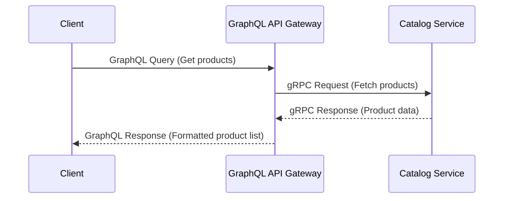

# Chapter 2: GraphQL API Gateway

In [Chapter 1: Microservice Architecture](01_microservice_architecture_.md), we learned why breaking our online store into smaller, independent services (Account, Catalog, Order) is beneficial. But this raises a new question: if we have multiple services, how does our website frontend (or mobile app) know which service to talk to for different pieces of information?

Imagine trying to get information from a big company. You wouldn't want to call the HR department directly for sales questions, and the Sales department for inventory questions. It would be confusing to keep track of all the different phone numbers and departments! You'd much rather call a single reception desk that can route your request to the right place.

Our microservices have the same problem. The client application (like our web frontend) needs data that might come from the Account service, the Catalog service, *and* the Order service, maybe even all at once! Making the frontend connect to each service individually is complicated and messy.

This is where the **GraphQL API Gateway** comes in!

## The Central Receptionist: Our API Gateway

Think of the API Gateway as the central receptionist for our entire system. It acts as the **single entry point** for all requests coming from client applications.


*(Image: Client talking *only* to API Gateway, which then talks to Account, Catalog, and Order services)*

Instead of the client needing to know the addresses and communication methods for all the different microservices, it only needs to know how to talk to *one* thing: the API Gateway.

**What does the Gateway do?**
1.  **Listens:** It waits for requests from clients (like our web frontend).
2.  **Understands:** It uses **GraphQL** to understand precisely what data the client needs.
3.  **Delegates:** It figures out which microservice(s) have the requested data (Account, Catalog, or Order).
4.  **Communicates:** It talks to those microservices using their internal language ([gRPC & Protocol Buffers](06_grpc___protocol_buffers_.md)).
5.  **Aggregates:** It gathers the responses from the different services.
6.  **Responds:** It combines everything into a single, neat GraphQL response and sends it back to the client.

## GraphQL: Asking for Exactly What You Need

So, how does the client tell the Gateway what it wants? It uses **GraphQL**. GraphQL is a special language for asking APIs for data. The cool thing about GraphQL is that the client can ask for *exactly* the fields it needs, nothing more, nothing less.

Think of it like ordering a custom pizza: you specify the crust, the sauce, and *exactly* the toppings you want. You don't just get a "standard pizza" with toppings you might not need.

In our project, the file `graphql/schema.graphql` defines the "menu" of what data clients *can* ask for. It defines the types of data available (like `Account`, `Product`, `Order`) and the specific questions (queries) clients can ask.

Let's look at a small part of our schema:

```graphql
# File: graphql/schema.graphql (snippet)

# Defines what a Product looks like
type Product {
  id: String!
  name: String!
  description: String!
  price: Float!
}

# Defines the available "questions" clients can ask
type Query {
  # Ask for a list of products.
  # Can optionally filter by ID or use pagination.
  products(pagination: PaginationInput, query: String, id: String): [Product!]!
}
```

This tells us:
1.  There's a data type called `Product` with fields like `id`, `name`, `description`, and `price`.
2.  Clients can ask a `Query` named `products` to get a list of these `Product` items.

So, if our frontend wants to display a list of product names and prices, it could send a GraphQL query like this to the API Gateway:

```graphql
query GetProductList {
  products {
    id
    name
    price
  }
}
```

Notice how the query structure matches the `schema.graphql`. The client asks for `products`, and specifically requests the `id`, `name`, and `price` for each product. It doesn't ask for the `description`, so the Gateway won't fetch or return it – very efficient!

## How the Gateway Handles a Request: Under the Hood

Let's trace that `GetProductList` query:

1.  **Client Sends Query:** The web frontend sends the GraphQL query above to the single endpoint of our API Gateway (e.g., `http://api.ourstore.com/graphql`).
2.  **Gateway Receives:** The API Gateway receives this query.
3.  **Gateway Understands:** It looks at its `schema.graphql` and understands the client wants a list of products, specifically their `id`, `name`, and `price`.
4.  **Gateway Delegates:** The Gateway knows that product information is handled by the [Catalog Service](04_catalog_service_.md).
5.  **Gateway Calls Service:** The Gateway makes an internal [gRPC & Protocol Buffers](06_grpc___protocol_buffers_.md) call to the Catalog Service, essentially asking, "Hey Catalog Service, give me the list of products."
6.  **Service Responds:** The Catalog Service retrieves the product data from its database and sends it back to the Gateway via gRPC.
7.  **Gateway Formats:** The Gateway takes the raw data from the Catalog Service and formats it into the GraphQL structure requested by the client (including only `id`, `name`, and `price`).
8.  **Gateway Responds to Client:** The Gateway sends a single JSON response back to the frontend, looking something like this:

```json
{
  "data": {
    "products": [
      { "id": "prod-123", "name": "Super Widget", "price": 19.99 },
      { "id": "prod-456", "name": "Mega Gadget", "price": 29.95 },
      // ... more products
    ]
  }
}
```

Here's a simplified diagram showing the flow:



## A Peek at the Gateway's Code

While the exact implementation involves GraphQL libraries and gRPC clients, let's look at a simplified concept of how the Gateway might handle the `products` query in Go.

Inside the Gateway's code (conceptually in the `graphql/` directory), there would be a function (often called a "resolver") responsible for fetching products.

```go
// Simplified Go code in the API Gateway (graphql/ directory)

// Resolver function for the "products" query in schema.graphql
func (r *queryResolver) Products(ctx context.Context, /* other args */ id *string) ([]*Product, error) {

    // 1. Get a connection to the Catalog microservice
    // (Error handling omitted for brevity)
    catalogConn := connectToCatalogService() // Connects using gRPC
    defer catalogConn.Close()
    catalogClient := NewCatalogServiceClient(catalogConn) // gRPC client

    // 2. Prepare the gRPC request based on query input (e.g., ID)
    grpcRequest := &catalog_pb.GetProductsRequest{}
    if id != nil {
        grpcRequest.Id = *id
    }

    // 3. Call the Catalog service via gRPC
    log.Printf("Calling Catalog Service's GetProducts method...")
    grpcResponse, err := catalogClient.GetProducts(ctx, grpcRequest)
    // Handle potential errors...

    // 4. Convert the gRPC response (from Catalog service)
    //    into the GraphQL Product type defined in our schema.
    graphqlProducts := []*Product{}
    for _, p := range grpcResponse.GetProducts() {
        graphqlProducts = append(graphqlProducts, &Product{
            ID:    p.GetId(),
            Name:  p.GetName(),
            Price: p.GetPrice(),
            // Description is NOT mapped if client didn't ask
        })
    }

    log.Printf("Returning %d products", len(graphqlProducts))
    return graphqlProducts, nil // Return data for GraphQL response
}

```

**Explanation:**

1.  **Connect:** The code first establishes a connection to the [Catalog Service](04_catalog_service_.md) using gRPC. (We'll learn more about gRPC connections in [Chapter 6: gRPC & Protocol Buffers](06_grpc___protocol_buffers_.md)).
2.  **Prepare Request:** It creates a gRPC request message, potentially including filters like a product ID if the client provided one in the GraphQL query.
3.  **Call Service:** It uses the gRPC client (`catalogClient`) to call the `GetProducts` function *on the Catalog microservice*. This is the core delegation step!
4.  **Convert & Return:** It takes the list of products received from the Catalog Service (in the gRPC format) and converts them into the format expected by the GraphQL schema (`*Product`). Crucially, it only maps the fields the GraphQL layer needs to fulfill the client's original query. The GraphQL library then sends this back to the client.

This resolver acts as the translator and delegator, connecting the client's GraphQL request to the appropriate backend microservice via gRPC. Similar resolvers exist for `accounts` (talking to the Account Service) and `orders` (talking to the Order Service).

## Conclusion

The **GraphQL API Gateway** is a crucial component in our microservice architecture. It acts as the single entry point, simplifying client interactions by providing one consistent GraphQL interface. It receives client requests, translates them into gRPC calls to the appropriate downstream microservices ([Account Service](03_account_service_.md), [Catalog Service](04_catalog_service_.md), [Order Service](05_order_service_.md)), gathers the results, and sends a unified response back.

You now understand how clients interact with our system and how the Gateway orchestrates communication between the client and the underlying microservices.

Now that we've seen the "front door" (the Gateway), let's step inside and look at the individual "departments" it talks to. We'll start by exploring the service responsible for managing user information.

Ready to dive into our first microservice? Let's go to [Chapter 3: Account Service](03_account_service_.md)!

---

Generated by [AI Codebase Knowledge Builder](https://github.com/The-Pocket/Tutorial-Codebase-Knowledge)