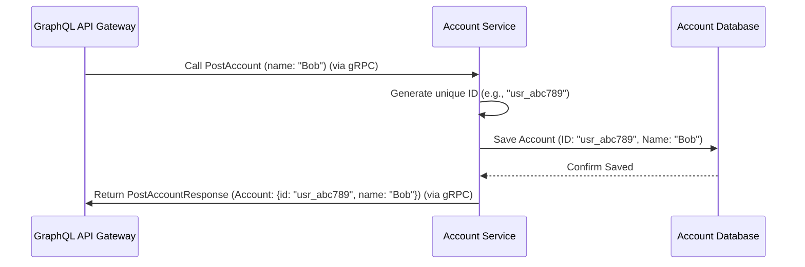

# Chapter 3: Account Service

In [Chapter 2: GraphQL API Gateway](02_graphql_api_gateway_.md), we saw how the API Gateway acts as the central receptionist, taking requests from the outside world (like a web browser) and deciding which internal "department" or microservice should handle them.

Now, let's visit one of those departments: the **Account Service**.

## Meet the Registration Desk

Imagine our online store is a physical store. The Account Service is like the **customer registration desk** near the entrance. Its *only* job is to manage customer information.

*   **Need to sign up as a new customer?** Go to the Account Service desk.
*   **Need to look up your customer details?** Go to the Account Service desk.

This service doesn't handle products or orders; it's laser-focused on **users** or **accounts**. This focus makes it simpler to build, update, and manage.

**Why have a separate service just for accounts?**
Think about it: user information (name, ID, maybe email later) is fundamental. Many other parts of the system might need to know *who* the user is. By having a dedicated service, we create a single source of truth for account data. The [Order Service](05_order_service_.md), for example, can simply ask the Account Service, "Tell me about customer ID X," instead of having to manage user data itself.

## Defining the "Account" and What It Can Do

How does the Account Service tell other services (like the [GraphQL API Gateway](02_graphql_api_gateway_.md)) what it can do and what kind of data it handles? It uses a formal contract written using Protocol Buffers, which we'll explore more in [Chapter 6: gRPC & Protocol Buffers](06_grpc___protocol_buffers_.md).

For now, let's look at the key parts of this contract defined in `account/account.proto`.

**1. Defining the Data (`Account` message):**
This part describes *what* an "Account" looks like in our system.

```protobuf
// File: account/account.proto (Snippet)

// Defines the structure for user account information
message Account {
    string id = 1;    // A unique identifier for the account
    string name = 2;  // The name of the account holder
}
```

This is super simple! It just says an `Account` has:
*   An `id` (which is text, like "user-123")
*   A `name` (also text, like "Alice")

**2. Defining the Actions (Service RPCs):**
This part describes the *operations* or *actions* the Account Service can perform. Think of these as the specific tasks the registration desk can handle.

```protobuf
// File: account/account.proto (Snippet)

// Defines the requests and responses for creating an account
message PostAccountRequest {
    string name = 1; // Input: Just need the name to create an account
}
message PostAccountResponse {
    Account account = 1; // Output: Returns the newly created Account details
}

// Defines the requests and responses for getting an account by ID
message GetAccountRequest {
    string id = 1; // Input: Need the ID of the account to fetch
}
message GetAccountResponse {
    Account account = 1; // Output: Returns the details of the found Account
}

// Defines the service itself and its available actions (Remote Procedure Calls)
service AccountService {
    // Action: Create a new account
    rpc PostAccount (PostAccountRequest) returns (PostAccountResponse) {}

    // Action: Get details for an existing account by its ID
    rpc GetAccount (GetAccountRequest) returns (GetAccountResponse) {}

    // (Other actions like GetAccounts exist but we focus on these two)
}
```

This tells us the Account Service offers two main actions relevant to our example:
*   `PostAccount`: You give it a `name` (`PostAccountRequest`), and it creates a new account, returning the full `Account` details (`PostAccountResponse`), including the newly generated `id`.
*   `GetAccount`: You give it an `id` (`GetAccountRequest`), and it returns the `Account` details (`GetAccountResponse`) for that specific user.

This `.proto` file is the clear, unambiguous "menu" of services offered by the Account Service.

## How Does it Work? A Typical Interaction

Let's imagine the [GraphQL API Gateway](02_graphql_api_gateway_.md) needs to create a new user named "Bob". Based on the contract (`account.proto`), the Gateway knows it needs to call the `PostAccount` action on the Account Service.

Here's a simplified sequence of events:



1.  **Request Received:** The Account Service receives a `PostAccount` request from the Gateway via gRPC, containing the name "Bob".
2.  **Process:** It generates a unique ID for Bob (e.g., "usr\_abc789").
3.  **Persistence:** It needs to *save* this new account information so it remembers Bob later. It interacts with its own dedicated database. (We'll touch on databases in [Chapter 7: Data Schemas & Persistence](07_data_schemas___persistence_.md)).
4.  **Database Interaction:** The service tells its database to store the new record: ID "usr\_abc789", Name "Bob". The database confirms it's saved.
5.  **Response:** The Account Service packages the new account details (ID and name) into a `PostAccountResponse` message.
6.  **Send Back:** It sends this response back to the Gateway via gRPC.

The process for `GetAccount` is similar: receive the ID, ask the database for the account with that ID, and return the found details.

## Peeking Under the Hood

**1. The Database Schema:**
How does the Account Service store the data? It uses a database table. The structure of this table is defined in `account/up.sql`.

```sql
-- File: account/up.sql

-- Create a table named 'accounts' if it doesn't already exist
CREATE TABLE IF NOT EXISTS accounts (
  id CHAR(27) PRIMARY KEY,  -- The unique ID, fixed length text, primary key
  name VARCHAR(24) NOT NULL -- The name, variable length text, cannot be empty
);
```

This SQL command creates a simple table named `accounts` with two columns: `id` and `name`, perfectly matching the fields defined in our `Account` message in `account.proto`.

**2. Service Independence (Docker):**
Just like we saw in [Chapter 1: Microservice Architecture](01_microservice_architecture_.md), the Account Service is built and packaged independently using Docker. The `account/app.dockerfile` contains instructions to build *only* the Account Service code.

```dockerfile
# File: account/app.dockerfile (Simplified)
# Use a Go base image
FROM golang:1.13-alpine3.11 AS build
WORKDIR /go/src/github.com/akhilsharma90/go-graphql-microservice

# Copy only files needed for the Account service
COPY go.mod go.sum ./
COPY vendor vendor
COPY account account # <-- Only account code!

# Build the account service binary
RUN GO111MODULE=on go build -mod vendor -o /go/bin/app ./account/cmd/account

# --- Use a smaller image to run ---
FROM alpine:3.11
WORKDIR /usr/bin
# Copy only the built application
COPY --from=build /go/bin .
EXPOSE 8080 # Port the service listens on
CMD ["app"] # Run the service
```

This Dockerfile ensures that the Account Service is a self-contained unit. It even has its own database definition (`account/db.dockerfile`) and schema (`account/up.sql`), highlighting its independence.

**3. Handling Requests (Conceptual Go Code):**
Inside the Account Service's Go code (conceptually in `account/internal/service.go`), there would be functions to handle the gRPC requests defined in `account.proto`. Here's a *highly simplified* idea of what the `PostAccount` handler might look like:

```go
// Conceptual Go code inside the Account Service

import (
    "context"
    "log"
    "github.com/google/uuid" // For generating IDs
    pb "path/to/your/account/pb" // Your generated protobuf code
    // ... other imports (database driver etc.)
)

// This struct holds things the service needs, like a database connection
type AccountServiceImpl struct {
    // db *sql.DB // Database connection (details omitted)
    pb.UnimplementedAccountServiceServer // Required for gRPC
}

// Handles the PostAccount gRPC request
func (s *AccountServiceImpl) PostAccount(ctx context.Context, req *pb.PostAccountRequest) (*pb.PostAccountResponse, error) {
    log.Printf("Received PostAccount request for name: %s", req.GetName())

    // 1. Generate a unique ID (example)
    newID := "usr_" + uuid.New().String()[:8] // Simple unique ID

    // 2. Create the Account object
    newAccount := &pb.Account{
        Id:   newID,
        Name: req.GetName(),
    }

    // 3. !!! Save the newAccount to the database !!!
    //    (Database interaction code is omitted for simplicity)
    //    err := saveAccountToDB(s.db, newAccount)
    //    if err != nil { return nil, err /* handle error */ }
    log.Printf("Simulating saving account ID: %s, Name: %s to DB", newID, req.GetName())

    // 4. Create the response
    res := &pb.PostAccountResponse{
        Account: newAccount,
    }

    log.Printf("Returning created account ID: %s", newID)
    return res, nil // Send the response back
}

// GetAccount handler would be similar: receive ID, query DB, return account or error.
```

This snippet shows the basic flow:
1.  Receive the request data (`req.GetName()`).
2.  Perform business logic (generate an ID).
3.  Interact with the database (the crucial step of saving the data - commented out here for brevity).
4.  Prepare and return the response according to the `.proto` definition.

## Conclusion

You've now met the **Account Service**, our dedicated microservice for managing user accounts. You learned:
*   Its specific responsibility: Creating and retrieving user account information.
*   How it defines its data (`Account`) and actions (`PostAccount`, `GetAccount`) using Protocol Buffers (`account.proto`).
*   How it interacts with its own database to store information (`account/up.sql`).
*   How it's built independently (using its `Dockerfile`).
*   The basic flow of handling a request, like creating a new account.

This service acts as the single source of truth for user data within our system.

Next, let's explore another essential department in our online store: the service responsible for showing off the items we sell.

Ready to browse the shelves? Let's move on to [Chapter 4: Catalog Service](04_catalog_service_.md)!

---

Generated by [AI Codebase Knowledge Builder](https://github.com/The-Pocket/Tutorial-Codebase-Knowledge)