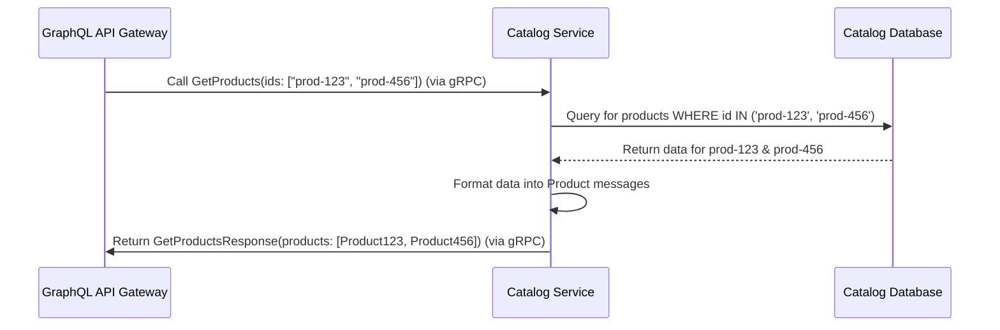

# Chapter 4: Catalog Service

In [Chapter 3: Account Service](03_account_service_.md), we explored the "registration desk" of our online store – the service dedicated solely to managing customer accounts. Now, let's move on to the part of the store where the actual items for sale are managed: the **Catalog Service**.

## Welcome to the Inventory Room

Think of the Catalog Service as the **store's inventory system** or the back room where all product information is kept organized. Its main job is to keep track of every product available for sale: what it's called, what it does, and how much it costs.

*   **Need to add a new product to the store?** Tell the Catalog Service.
*   **Need to find out the price of a specific gadget?** Ask the Catalog Service.
*   **Want to browse all available items?** The Catalog Service provides the list.

This service doesn't worry about *who* is buying (that's the [Account Service](03_account_service_.md)'s job) or *how* the purchase happens (that's the [Order Service](05_order_service_.md)'s job). It focuses only on **products**.

**Why a separate service for the catalog?**
Product information is essential for many operations. The website needs it to display items to customers. The [Order Service](05_order_service_.md) needs it to know the price of items being ordered. By centralizing product management in the Catalog Service, we ensure all other parts of our system get consistent and up-to-date product details from a single source.

## Defining the "Product" and What the Service Can Do

Just like the Account Service, the Catalog Service needs a clear contract to tell other services what it manages and what actions it can perform. This contract is defined using Protocol Buffers in the `catalog/catalog.proto` file.

**1. Defining the Data (`Product` message):**
This describes what a "Product" looks like in our system.

```protobuf
// File: catalog/catalog.proto (Snippet)

// Defines the structure for product information
message Product {
    string id = 1;          // Unique ID for the product (e.g., "prod-xyz")
    string name = 2;        // Name of the product (e.g., "Super Widget")
    string description = 3; // What the product is/does
    double price = 4;       // How much it costs (e.g., 19.99)
}
```

This tells us a `Product` has:
*   An `id` (text)
*   A `name` (text)
*   A `description` (text)
*   A `price` (a number with decimals)

**2. Defining the Actions (Service RPCs):**
This part lists the operations the Catalog Service can perform. Think of these as the specific tasks the inventory manager can handle.

```protobuf
// File: catalog/catalog.proto (Snippet)

// --- Messages for Adding a Product ---
message PostProductRequest { // What you send TO the service
    string name = 1;
    string description = 2;
    double price = 3;
    // Note: ID is generated by the service, not provided here
}
message PostProductResponse { // What the service sends BACK
    Product product = 1; // Returns the full details of the newly added product
}

// --- Messages for Getting ONE Product ---
message GetProductRequest {
    string id = 1; // Input: The ID of the product you want
}
message GetProductResponse {
    Product product = 1; // Output: The details of that specific product
}

// --- Messages for Getting MULTIPLE Products ---
message GetProductsRequest {
    // Allows asking for specific products by their IDs
    repeated string ids = 3;
    // Could also include filters like search query, skip/take for pagination
}
message GetProductsResponse {
    // Returns a list of products that match the request
    repeated Product products = 1;
}

// Defines the service and its available actions
service CatalogService {
    // Action: Add a new product to the catalog
    rpc PostProduct (PostProductRequest) returns (PostProductResponse) {}

    // Action: Get details for one specific product by its ID
    rpc GetProduct (GetProductRequest) returns (GetProductResponse) {}

    // Action: Get a list of products (potentially filtered)
    rpc GetProducts (GetProductsRequest) returns (GetProductsResponse) {}
}
```

This contract tells other services (like our [GraphQL API Gateway](02_graphql_api_gateway_.md)) that the Catalog Service can:
*   `PostProduct`: Add a new product. You provide the `name`, `description`, and `price`. The service creates it, assigns a unique `id`, and returns the complete `Product` details.
*   `GetProduct`: Fetch a single product if you know its `id`.
*   `GetProducts`: Fetch a list of products, potentially asking for specific ones by their `ids`.

## How It Works: A Typical Interaction

Let's say our website, through the [GraphQL API Gateway](02_graphql_api_gateway_.md), needs to display the details for two specific products with IDs "prod-123" and "prod-456". The Gateway knows from the `.proto` file that it should call the `GetProducts` action on the Catalog Service.

Here’s a simplified flow:



1.  **Request Received:** The Catalog Service gets a `GetProducts` request via gRPC, asking for products with IDs "prod-123" and "prod-456".
2.  **Persistence:** The Catalog Service needs to retrieve this information from where it's stored permanently – its own dedicated database.
3.  **Database Interaction:** It asks its database: "Find me the products with these specific IDs". The database looks them up and sends the raw data back.
4.  **Format Response:** The service takes the data from the database and formats it into the `Product` message structure defined in the `.proto` file.
5.  **Send Back:** It packages these `Product` messages into a `GetProductsResponse` and sends it back to the Gateway via gRPC.

Adding a product (`PostProduct`) would be similar: receive name/description/price, generate an ID, save it all to the database, and return the newly created product details.

## Peeking Under the Hood

**1. The Database Schema:**
How does the Catalog Service store product data? It uses a database table defined in `catalog/up.sql`.

```sql
-- File: catalog/up.sql (Snippet)

-- Create a table named 'products' if it doesn't already exist
CREATE TABLE IF NOT EXISTS products (
  id CHAR(27) PRIMARY KEY,         -- Unique ID (fixed text length)
  name VARCHAR(255) NOT NULL,      -- Product name (variable text, required)
  description TEXT,                -- Longer description (text)
  price FLOAT NOT NULL             -- Price (number with decimals, required)
);
```

This SQL creates a `products` table with columns (`id`, `name`, `description`, `price`) that directly correspond to the fields in our `Product` message definition in `catalog/catalog.proto`. This is where the product inventory lives.

**2. Service Independence (Docker):**
Just like the Account Service, the Catalog Service is a completely separate application. Its `catalog/app.dockerfile` contains instructions to build *only* the Catalog Service code, packaging it into an independent runnable unit (a Docker image). It manages its own code and its own database schema (`catalog/up.sql`).

**3. Handling Requests (Conceptual Go Code):**
Inside the Catalog Service's Go code (conceptually in `catalog/internal/service.go`), functions handle the gRPC requests defined in `catalog.proto`. Here’s a *very simplified* idea of what the `GetProduct` handler might look like:

```go
// Conceptual Go code inside the Catalog Service

import (
    "context"
    "log"
    pb "path/to/your/catalog/pb" // Your generated protobuf code
    // ... other imports (database driver etc.)
)

// This struct holds things the service needs, like a database connection
type CatalogServiceImpl struct {
    // db *sql.DB // Database connection (details omitted)
    pb.UnimplementedCatalogServiceServer // Required for gRPC
}

// Handles the GetProduct gRPC request
func (s *CatalogServiceImpl) GetProduct(ctx context.Context, req *pb.GetProductRequest) (*pb.GetProductResponse, error) {
    productID := req.GetId()
    log.Printf("Received GetProduct request for ID: %s", productID)

    // 1. !!! Look up the product in the database using productID !!!
    //    (Database interaction code is omitted for simplicity)
    //    foundProductData, err := findProductInDB(s.db, productID)
    //    if err != nil { /* handle error, e.g., return 'not found' */ }

    // Simulate finding a product in the DB:
    log.Printf("Simulating database lookup for product ID: %s", productID)
    simulatedProduct := &pb.Product{
        Id:          productID,
        Name:        "Fetched Widget",
        Description: "This widget was 'retrieved' from the database.",
        Price:       15.50,
    }

    // 2. Create the response message
    res := &pb.GetProductResponse{
        Product: simulatedProduct, // Use the data found (or simulated)
    }

    log.Printf("Returning product: %s", simulatedProduct.GetName())
    return res, nil // Send the response back to the caller (e.g., the Gateway)
}

// PostProduct handler would: generate ID, save to DB, return product.
// GetProducts handler would: query DB for multiple IDs, return list.
```

This conceptual code shows the basic pattern:
1.  Receive the request, getting the needed input (like the `productID`).
2.  Interact with the database to perform the core logic (find the product).
3.  Format the results according to the `.proto` contract (`GetProductResponse` containing a `Product`).
4.  Return the response.

## Conclusion

You've now explored the **Catalog Service**, our microservice dedicated to managing the store's product inventory. You learned:
*   Its core responsibility: Adding and retrieving product details (name, description, price).
*   How it defines its data (`Product`) and actions (`PostProduct`, `GetProduct`, `GetProducts`) using Protocol Buffers (`catalog.proto`).
*   How it relies on its own database to store product information (`catalog/up.sql`).
*   How it operates as an independent, self-contained service.
*   The basic flow of handling requests, such as fetching product details.

With the Account Service managing users and the Catalog Service managing products, we have two key pieces of our online store in place. But how do we actually bring these together to let a customer *buy* a product? That's where our next service comes in.

Ready to see how orders are placed? Let's move on to [Chapter 5: Order Service](05_order_service_.md)!

---

Generated by [AI Codebase Knowledge Builder](https://github.com/The-Pocket/Tutorial-Codebase-Knowledge)