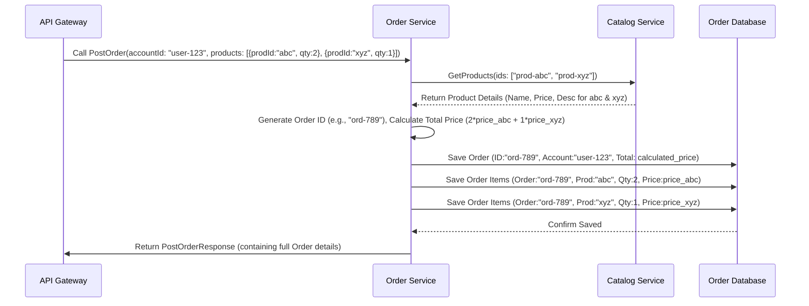

# Chapter 5: Order Service

In [Chapter 4: Catalog Service](04_catalog_service_.md), we explored the inventory room of our online store, where product information is managed. We now have a way to manage users ([Account Service](03_account_service_.md)) and a way to manage products ([Catalog Service](04_catalog_service_.md)). But how do we actually connect a user to a product they want to buy? We need a checkout process!

That's where the **Order Service** comes in.

## The Checkout Counter & Order History Department

Think of the Order Service as the **checkout counter** combined with the **order history department** of our online store. Its primary jobs are:

1.  **Creating Orders:** When a customer decides to buy something, the Order Service takes the details (who the customer is, what products they want, how many of each) and creates an official order record.
2.  **Retrieving Orders:** If a customer wants to see their past purchases, the Order Service can look up their order history.

This service is crucial because it brings together information from other parts of our system. To create an order, it needs to know:
*   **Who** is buying? (It might need to check with the [Account Service](03_account_service_.md) to ensure the customer account exists).
*   **What** are they buying, and for how much? (It needs to get product details and prices from the [Catalog Service](04_catalog_service_.md)).

It then calculates the total price and saves everything as a permanent record.

## Defining an "Order" and What the Service Can Do

Like our other services, the Order Service uses a Protocol Buffer file (`order/order.proto`) to define the data it handles and the actions it offers.

**1. Defining the Data (`Order` message):**
This describes what an "Order" looks like. Notice it includes details about the products *within* the order.

```protobuf
// File: order/order.proto (Snippet)

// Defines the structure for a completed order
message Order {
    // Inner message defining a product within an order
    message OrderProduct {
        string id = 1;          // Product's unique ID
        string name = 2;        // Product's name (at time of order)
        string description = 3; // Product's description (at time of order)
        double price = 4;       // Product's price (at time of order)
        uint32 quantity = 5;    // How many of this product were ordered
    }

    string id = 1;                  // Unique ID for this specific order
    bytes createdAt = 2;            // When the order was placed (timestamp)
    string accountId = 3;           // ID of the customer account that placed the order
    double totalPrice = 4;          // The total cost of the entire order
    repeated OrderProduct products = 5; // A list of products included in this order
}
```

This tells us an `Order` contains:
*   Its own unique `id`.
*   A timestamp (`createdAt`).
*   The `accountId` of the buyer.
*   The `totalPrice`.
*   A list (`repeated`) of `OrderProduct` items, each detailing a specific product purchased in that order (including its ID, name, price, and quantity).

**2. Defining the Actions (Service RPCs):**
This part lists the main operations the Order Service can perform.

```protobuf
// File: order/order.proto (Snippet)

// --- Messages for Creating an Order ---
message PostOrderRequest {
    // Inner message for specifying products in the request
    message OrderProduct {
        string productId = 2; // ID of the product to order
        uint32 quantity = 3;  // How many to order
    }

    string accountId = 2;                // ID of the account placing the order
    repeated OrderProduct products = 4;  // List of products and quantities being ordered
}
message PostOrderResponse {
    Order order = 1; // Returns the full details of the newly created Order
}

// --- Messages for Getting Orders for a Specific Account ---
message GetOrdersForAccountRequest {
    string accountId = 1; // Input: The ID of the account whose orders you want
}
message GetOrdersForAccountResponse {
    repeated Order orders = 1; // Output: A list of all orders placed by that account
}

// Defines the service and its available actions
service OrderService {
    // Action: Create a new order
    rpc PostOrder (PostOrderRequest) returns (PostOrderResponse) {}

    // Action: Get all orders associated with a specific account ID
    rpc GetOrdersForAccount (GetOrdersForAccountRequest) returns (GetOrdersForAccountResponse) {}
    // (A GetOrder RPC for a single order ID also exists but we focus on these)
}
```

This contract tells other services, especially our [GraphQL API Gateway](02_graphql_api_gateway_.md), that the Order Service can:
*   `PostOrder`: Create a new order. You need to provide the `accountId` and a list of `productId`s with their desired `quantity`. The service will figure out the rest (like prices), save the order, and return the complete `Order` details.
*   `GetOrdersForAccount`: Retrieve the history of all orders placed by a specific customer, identified by their `accountId`.

## How It Works: Use Case - Placing an Order

Let's imagine customer "user-123" wants to buy:
*   2 units of product "prod-abc"
*   1 unit of product "prod-xyz"

The request originates from the user interacting with the website, goes through the [GraphQL API Gateway](02_graphql_api_gateway_.md), and finally reaches the Order Service as a `PostOrder` request.

Here's a simplified flow showing how the Order Service coordinates with others:



1.  **Request Received:** The Order Service gets the `PostOrderRequest` with the account ID and the list of desired product IDs and quantities.
2.  **Fetch Product Details:** The Order Service *must* know the current price and details of the products being ordered. It calls the `GetProducts` action on the [Catalog Service](04_catalog_service_.md), asking for information about "prod-abc" and "prod-xyz".
3.  **Catalog Responds:** The Catalog Service sends back the current name, description, and price for those products.
4.  **Calculate & Prepare:** The Order Service generates a unique ID for this new order. It uses the prices received from the Catalog Service and the quantities from the request to calculate the `totalPrice`. It prepares the full `Order` data structure, including the list of `OrderProduct` details.
5.  **Persistence:** The Order Service saves this new order to its *own* database. This usually involves saving the main order information and the individual product line items. (We'll see the tables below).
6.  **Database Confirms:** The database signals that the order has been successfully saved.
7.  **Response:** The Order Service packages the complete, newly created `Order` details into a `PostOrderResponse` and sends it back to the caller (the Gateway).

*(Note: In a real-world scenario, it might also verify the `accountId` with the [Account Service](03_account_service_.md), but we've simplified the diagram here.)*

## Peeking Under the Hood

**1. The Database Schema (`order/up.sql`):**
How does the Order Service store order information permanently? It uses its own database tables, defined in `order/up.sql`. Since an order involves multiple products, we need two tables: one for the overall order and one for the items within each order.

```sql
-- File: order/up.sql (Snippet 1 - Orders Table)

-- Create a table for the main order information
CREATE TABLE IF NOT EXISTS orders (
  id CHAR(27) PRIMARY KEY,                -- Unique order ID
  created_at TIMESTAMP WITH TIME ZONE NOT NULL, -- When it was created
  account_id CHAR(27) NOT NULL,          -- Which account placed it
  total_price MONEY NOT NULL            -- The calculated total price
);
```
This `orders` table stores the general information about each order.

```sql
-- File: order/up.sql (Snippet 2 - Order Products Table)

-- Create a table linking orders to the products they contain
CREATE TABLE IF NOT EXISTS order_products (
  order_id CHAR(27) REFERENCES orders (id) ON DELETE CASCADE, -- Links to the 'orders' table
  product_id CHAR(27),                  -- The ID of the product included
  quantity INT NOT NULL,                -- How many of that product
  PRIMARY KEY (product_id, order_id)    -- Ensures a product appears only once per order
);
```
This `order_products` table links back to the `orders` table using `order_id`. It stores each product line item within an order, including the `product_id` and the `quantity`. Notice it *doesn't* store the price here; the price at the time of order is effectively captured in the `total_price` of the main `orders` record (or could be stored here too in a more complex schema).

**2. Service Independence (`order/app.dockerfile`):**
Just like the others, the Order Service is built independently using its own `order/app.dockerfile`. It packages its specific code and dependencies into a self-contained Docker image. Notice its `Dockerfile` copies code from `account` and `catalog` as well - this is likely because it needs the *generated client code* from their `.proto` files to be able to communicate with them via gRPC.

```dockerfile
# File: order/app.dockerfile (Simplified)
FROM golang:1.13-alpine3.11 AS build
# ... setup ...
COPY go.mod go.sum ./
COPY vendor vendor
COPY account account   # Needed for account service client code
COPY catalog catalog   # Needed for catalog service client code
COPY order order     # The order service's own code
# Build the order service binary
RUN GO111MODULE=on go build -mod vendor -o /go/bin/app ./order/cmd/order
# ... rest of dockerfile ...
CMD ["app"]
```

**3. Handling Requests (Conceptual Go Code):**
Inside the Order Service's Go code (conceptually `order/internal/service.go`), functions handle the gRPC requests. Here’s a *highly simplified* idea of the `PostOrder` handler:

```go
// Conceptual Go code inside the Order Service

import (
    "context"
    "log"
    // Import generated protobuf code for order, catalog, account
    order_pb "path/to/your/order/pb"
    catalog_pb "path/to/your/catalog/pb" // To call Catalog Service
    // ... other imports (database, gRPC client setup, time, uuid)
)

// Service struct holds dependencies like DB connection & gRPC clients
type OrderServiceImpl struct {
    // db *sql.DB                  // Database connection
    // catalogClient catalog_pb.CatalogServiceClient // gRPC Client for Catalog Svc
    order_pb.UnimplementedOrderServiceServer
}

// Handles the PostOrder gRPC request
func (s *OrderServiceImpl) PostOrder(ctx context.Context, req *order_pb.PostOrderRequest) (*order_pb.PostOrderResponse, error) {
    log.Printf("Received PostOrder request for account: %s", req.GetAccountId())

    // 1. Extract Product IDs from request
    productIDs := []string{}
    for _, p := range req.GetProducts() {
        productIDs = append(productIDs, p.GetProductId())
    }

    // 2. !!! Call Catalog Service via gRPC to get product details !!!
    //    catalogReq := &catalog_pb.GetProductsRequest{Ids: productIDs}
    //    catalogRes, err := s.catalogClient.GetProducts(ctx, catalogReq)
    //    Handle errors...
    log.Printf("Simulating call to Catalog Service for products: %v", productIDs)
    // simulatedCatalogData := ... get dummy product data with prices ...

    // 3. Calculate total price and prepare OrderProduct details
    var totalPrice float64 = 0.0
    orderProducts := []*order_pb.Order_OrderProduct{}
    // Loop through requested products & use simulatedCatalogData...
    // totalPrice += float64(reqProduct.Quantity) * catalogProduct.Price
    // Append to orderProducts list...
    log.Printf("Simulating calculation of total price and order details.")

    // 4. Generate Order ID and timestamp
    newOrderID := "ord_" + uuid.New().String()[:8] // Example ID
    // currentTime := time.Now()

    // 5. !!! Save the Order and OrderProducts to the database !!!
    //    err := saveOrderToDB(s.db, newOrderID, currentTime, req.GetAccountId(), totalPrice)
    //    err = saveOrderProductsToDB(s.db, newOrderID, orderProducts)
    //    Handle transaction & errors...
    log.Printf("Simulating saving order %s to database.", newOrderID)

    // 6. Create the response
    res := &order_pb.PostOrderResponse{
        Order: &order_pb.Order{
            Id:         newOrderID,
            // CreatedAt:  ... timestamp ...,
            AccountId:  req.GetAccountId(),
            TotalPrice: totalPrice,
            Products:   orderProducts,
        },
    }

    log.Printf("Returning created order ID: %s", newOrderID)
    return res, nil
}
```

This conceptual code highlights the key steps:
1.  Get the requested product IDs.
2.  **Crucially: Call the Catalog Service** to get up-to-date product details (especially price).
3.  Calculate the total price based on quantities and fetched prices.
4.  Generate a unique ID for the order.
5.  **Save the order details** to the `orders` and `order_products` tables in the database.
6.  Return the complete order information as defined in the `.proto` file.

## Conclusion

You've now met the **Order Service**, the coordinator that brings user and product information together to create and manage customer orders. You learned:
*   Its core responsibilities: Creating orders and retrieving order history.
*   Its reliance on other services: It *must* talk to the [Catalog Service](04_catalog_service_.md) (for product details/prices) and implicitly relies on the [Account Service](03_account_service_.md) (for customer identity).
*   How it defines its data (`Order`, `OrderProduct`) and actions (`PostOrder`, `GetOrdersForAccount`) using Protocol Buffers (`order.proto`).
*   How it uses multiple database tables (`orders`, `order_products`) to store complex order data (`order/up.sql`).
*   The basic flow of creating an order, emphasizing the interaction with the Catalog Service.

With the Account, Catalog, and Order services defined, we have the core business logic components of our online store. But how exactly do these separate services talk to each other so efficiently?

Ready to learn about the communication technology that powers these interactions? Let's dive into [Chapter 6: gRPC & Protocol Buffers](06_grpc___protocol_buffers_.md)!

---

Generated by [AI Codebase Knowledge Builder](https://github.com/The-Pocket/Tutorial-Codebase-Knowledge)