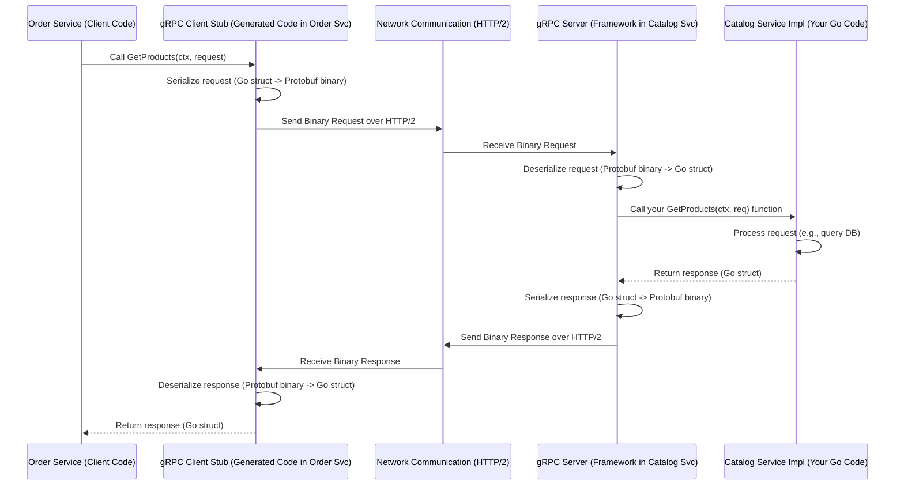

# Chapter 6: gRPC & Protocol Buffers

In the previous chapters, particularly when looking at the [Order Service](05_order_service_.md), we saw that our microservices don't live in isolation. The Order Service needed to ask the [Catalog Service](04_catalog_service_.md) for product details. But *how* exactly do these separate programs, potentially running on different machines, talk to each other?

Think about different departments in a large company. HR (our [Account Service](03_account_service_.md)), Inventory (our [Catalog Service](04_catalog_service_.md)), and Sales (our [Order Service](05_order_service_.md)) are separate, but they need to exchange information efficiently and accurately. Just shouting across the office isn't reliable! They need a formal, fast communication system.

For our microservices, this internal communication system is built using **gRPC** and **Protocol Buffers**.

## The Problem: Talking Between Services

When you have multiple independent services, they need a way to make requests and get responses from each other. For example, the Order Service needs to ask the Catalog Service: "What's the price of product 'prod-123'?"

We could use standard web technologies (like REST APIs using JSON over HTTP), but for internal communication *between* services, we often want something faster, more efficient, and stricter about the format of the data being exchanged. We want to prevent misunderstandings between our "departments".

## The Solution: A High-Speed Internal Phone System

Imagine our company installs a super-efficient internal phone system (that's **gRPC**) where every employee has a specific extension number and a very clear manual (that's **Protocol Buffers**) describing exactly what questions they can answer and what information they need for each question.

### 1. Protocol Buffers (`.proto` files): The Shared Manual

Before anyone can make a call, everyone needs to agree on the language and the topics they can discuss. **Protocol Buffers** (or **Protobuf**) define this agreement. They are a way to define the structure of the data being sent (`messages`) and the specific functions a service offers (`services` with `rpc` methods).

We've actually already seen these! Remember the `.proto` files in each service directory? Let's look at a snippet from `catalog/catalog.proto`:

```protobuf
// File: catalog/catalog.proto (Snippet)

// Defines the structure for product information
message Product {
    string id = 1;
    string name = 2;
    string description = 3;
    double price = 4;
}

// Defines the structure for asking for products by ID
message GetProductsRequest {
    repeated string ids = 3; // Looking for multiple IDs
}

// Defines the structure for the response containing products
message GetProductsResponse {
    repeated Product products = 1; // A list of Product messages
}

// Defines the service and its available actions (RPCs)
service CatalogService {
    // Action: Get a list of products (by IDs)
    rpc GetProducts (GetProductsRequest) returns (GetProductsResponse) {}
    // Other RPCs like GetProduct, PostProduct...
}
```

This `.proto` file acts as a strict contract:
*   **Messages (`Product`, `GetProductsRequest`, `GetProductsResponse`):** Define the exact fields and data types for the information being exchanged. It's like defining the layout of forms to be filled out. `string id = 1;` means there's a text field named `id`, and it's field number 1.
*   **Service (`CatalogService`):** Defines the collection of functions this service offers.
*   **RPC (`GetProducts`):** Defines a specific function (Remote Procedure Call). It clearly states that the `GetProducts` function takes a `GetProductsRequest` message as input and returns a `GetProductsResponse` message as output. It's like a page in the manual specifying: "To get product details, call extension `GetProducts` and provide the information specified in the `GetProductsRequest` form. You will receive back the `GetProductsResponse` form."

This contract is the **single source of truth** for how the Catalog Service communicates.

### 2. gRPC: The High-Speed Phone Lines

Knowing the language and the available functions is great, but we need the actual phone system to make the calls. That's **gRPC**.

gRPC is a modern, high-performance framework developed by Google for making Remote Procedure Calls. It takes the `.proto` contracts and provides the tools to:
*   **Generate Code:** Special tools read the `.proto` files and automatically generate Go code (or code in many other languages). This generated code includes:
    *   **Client Stubs:** Code that other services (like the Order Service) can use to easily *call* the functions defined in the `.proto` file (like `GetProducts`). It makes calling a remote function look almost like calling a local one.
    *   **Server Interfaces:** Code skeletons that the service provider (like the Catalog Service) must *implement* to actually handle the incoming calls for functions like `GetProducts`.
*   **Handle Communication:** gRPC uses modern standards like HTTP/2, making communication very fast and efficient.
*   **Serialize/Deserialize Data:** It automatically converts the Go data structures (like a `Product` struct) into a compact binary format (based on the Protobuf definition) for sending over the network, and then converts the binary data back into Go structs on the receiving end. This is much more efficient than sending human-readable text like JSON.

Think of gRPC as the phone network infrastructure *and* the automated operators who know how to connect calls based on the manual (`.proto`) and translate your request into the efficient signals needed for the network.

## Using gRPC and Protobuf: Order Service Asks Catalog Service

Let's revisit our use case: The [Order Service](05_order_service_.md) needs product details from the [Catalog Service](04_catalog_service_.md) when creating a new order.

1.  **The Contract (`catalog.proto`):** Both services have access to `catalog.proto`, defining `GetProducts`.
2.  **Code Generation:** During the build process, `protoc` (the Protocol Buffer compiler) and gRPC plugins generate Go code from `catalog.proto`. The Order Service gets client code, and the Catalog Service gets server code.
3.  **Catalog Service Implementation (Server Side):** The Catalog Service needs to provide the actual logic for the `GetProducts` function defined in the contract. This code uses the generated server interface.

    ```go
    // Simplified Go code in catalog/internal/service.go
    // (Implements the gRPC interface generated from catalog.proto)

    import (
        pb "path/to/your/catalog/pb" // Generated protobuf code
        // ... other imports
    )

    type CatalogServiceImpl struct {
        // db *sql.DB // Database connection
        pb.UnimplementedCatalogServiceServer // Required base
    }

    // This function signature matches the generated gRPC interface
    func (s *CatalogServiceImpl) GetProducts(ctx context.Context, req *pb.GetProductsRequest) (*pb.GetProductsResponse, error) {
        log.Printf("gRPC Server: Received GetProducts request for IDs: %v", req.GetIds())

        // 1. Use req.GetIds() to fetch products from the database
        //    (DB logic omitted)
        foundProducts := []*pb.Product{ /* ... fetch from DB ... */ }
        log.Printf("Simulating fetch from DB for %d products", len(foundProducts))

        // 2. Create the response message using the fetched data
        res := &pb.GetProductsResponse{
            Products: foundProducts,
        }

        return res, nil // Send the response back through gRPC
    }
    ```
    *Explanation:* This Go function in the Catalog Service implements the `GetProducts` RPC. It receives the request (`req`), performs its logic (like querying the database using `req.GetIds()`), and returns the response (`res`), all using the Go struct types generated from the `.proto` file. gRPC handles receiving the call and sending the response back.

4.  **Order Service Call (Client Side):** The Order Service uses the generated client code (a "stub") to call the Catalog Service's `GetProducts` function.

    ```go
    // Simplified Go code in order/internal/service.go
    // (Uses the gRPC client generated from catalog.proto)

    import (
        catalog_pb "path/to/your/catalog/pb" // Generated protobuf code
        // ... other imports (grpc client setup)
    )

    func placeOrder(ctx context.Context, /*...,*/ catalogClient catalog_pb.CatalogServiceClient) error {
        productIDsToFetch := []string{"prod-abc", "prod-xyz"}

        // Create the gRPC request message
        grpcRequest := &catalog_pb.GetProductsRequest{
            Ids: productIDsToFetch,
        }

        log.Printf("gRPC Client: Calling CatalogService.GetProducts with IDs: %v", productIDsToFetch)

        // *** Make the gRPC call! ***
        // Looks like a normal function call, but goes over the network.
        grpcResponse, err := catalogClient.GetProducts(ctx, grpcRequest)
        if err != nil {
            log.Printf("gRPC call failed: %v", err)
            return err // Handle error
        }

        // Use the response (list of products)
        log.Printf("gRPC Client: Received %d products from Catalog Service", len(grpcResponse.GetProducts()))
        // ... use grpcResponse.Products ...

        return nil
    }
    ```
    *Explanation:* This Go function in the Order Service wants product info. It creates the request message (`grpcRequest`) defined in `catalog.proto`. Then, it calls the `GetProducts` method on the `catalogClient` (which is the generated gRPC client stub). To the Order Service code, this looks like a regular function call! But underneath, gRPC is doing the heavy lifting: serializing the request, sending it over the network to the Catalog Service, waiting for the response, deserializing it, and returning it as `grpcResponse`.

## Under the Hood: The gRPC Call Flow

What actually happens during that `catalogClient.GetProducts(...)` call?



1.  **Client Call:** Your Order Service code calls the `GetProducts` function on the generated gRPC client stub.
2.  **Serialization:** The stub takes your Go request struct (`GetProductsRequest`) and uses the Protobuf rules to convert it into a compact binary format.
3.  **Network Send:** gRPC sends this binary data over the network (using HTTP/2) to the Catalog Service's address and port.
4.  **Server Receive:** The gRPC server framework running within the Catalog Service receives the binary data.
5.  **Deserialization:** The server uses the Protobuf rules to convert the binary data back into the corresponding Go request struct (`GetProductsRequest`).
6.  **Call Implementation:** The gRPC server calls *your* actual `GetProducts` implementation function (in `catalog/internal/service.go`), passing the deserialized request struct.
7.  **Server Logic:** Your function runs, fetches data from the database, and prepares the Go response struct (`GetProductsResponse`).
8.  **Serialization (Response):** Your function returns the response struct to the gRPC server framework, which serializes it into binary Protobuf format.
9.  **Network Send (Response):** The server sends the binary response back over the network to the Order Service.
10. **Client Receive:** The gRPC client stub in the Order Service receives the binary response.
11. **Deserialization (Response):** The stub deserializes the binary data back into the Go response struct (`GetProductsResponse`).
12. **Return to Client:** The stub returns the deserialized response struct to your original Order Service code that made the call.

All the complex serialization, deserialization, and network communication are handled automatically by gRPC, guided by the simple `.proto` contract!

## Conclusion

You've now learned about the crucial communication layer between our microservices: **gRPC** and **Protocol Buffers**.

*   **Protocol Buffers (`.proto`)** define the **contract**: the structure of messages and the available service functions (RPCs). They act as the shared manual or blueprint.
*   **gRPC** is the **communication framework**: It uses the `.proto` contracts to generate code and handle the efficient, strongly-typed, binary communication between services over the network. It's the high-speed internal phone system.

This combination allows our independent services ([Account Service](03_account_service_.md), [Catalog Service](04_catalog_service_.md), [Order Service](05_order_service_.md)) to collaborate effectively and reliably, forming the backbone of our microservice architecture.

Now that we understand how services talk to each other, let's look closer at how each service *stores* its own data persistently.

Ready to explore databases? Let's move on to [Chapter 7: Data Schemas & Persistence](07_data_schemas___persistence_.md)!

---

Generated by [AI Codebase Knowledge Builder](https://github.com/The-Pocket/Tutorial-Codebase-Knowledge)