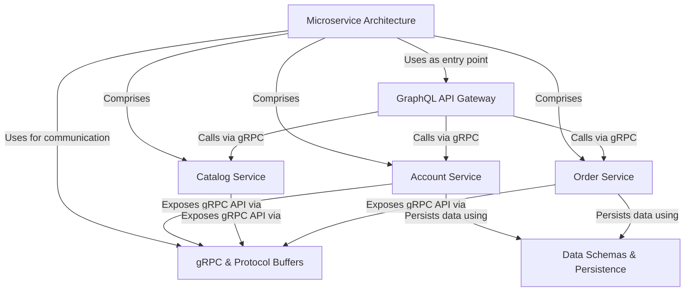

# Tutorial: go-grpc-graphql-microservices

This project demonstrates a backend system built using a **Microservice Architecture**.
It simulates core features of an online store, separating functionalities into independent services: *Account*, *Catalog*, and *Order*.
These services communicate *internally* using **gRPC**, a high-performance communication protocol defined by Protocol Buffers.
An **API Gateway** exposes a single *GraphQL* endpoint to the outside world, simplifying client interactions by consolidating data from the various microservices.
Each service manages its own data, with *Account* and *Order* using PostgreSQL databases defined by their specific schemas.

**Source Repository:** [https://github.com/hieuminh65/go-grpc-graphql-microservices](https://github.com/hieuminh65/go-grpc-graphql-microservices)

## Chapters

1. [Microservice Architecture
](01_microservice_architecture_.md)
2. [GraphQL API Gateway
](02_graphql_api_gateway_.md)
3. [Account Service
](03_account_service_.md)
4. [Catalog Service
](04_catalog_service_.md)
5. [Order Service
](05_order_service_.md)
6. [gRPC & Protocol Buffers
](06_grpc___protocol_buffers_.md)
7. [Data Schemas & Persistence
](07_data_schemas___persistence_.md)

---

Generated by [AI Codebase Knowledge Builder](https://github.com/The-Pocket/Tutorial-Codebase-Knowledge)